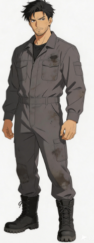
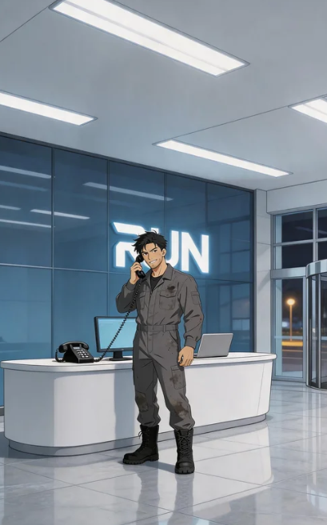
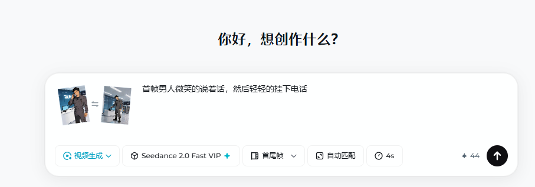
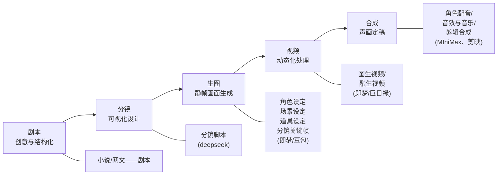
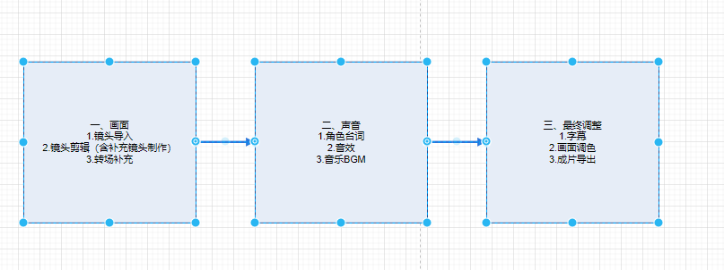

---

title: AI漫剧

---

| 阶段             | 工具                                                         |
| ---------------- | ------------------------------------------------------------ |
| 剧本/分镜        | 利用DeepSeek、Kimi等大语言模型，快速生成剧本大纲和结构化分镜提示词 |
| 静帧图           | 使用即梦AI、Midjourney等工具，生成高质量、风格统一的静帧画面，并解决角色一致性核心问题 |
| 视频生成         | 采用多模型并行策略，将不同镜头分配给擅长此类内容的模型（如可灵用于人物对话、vidu生成基础镜头等），提升效率与质量 |
| 音频生成与合成   | 利用剪映、ElevenLabs等工具进行AI配音、音效生成，最后在剪辑软件中完成声画合成、字幕添加和包装 |

# 镜头语言

## 大远景:交代环境
大远景主要展示广阔的地理环境。

在漫剧中常用于开场或转场，建立空间感，角色往往只占极小比例，突出人与自然或环境的对比。
远山、城市画面范围:整个地貌、

叙事目的:交代背景、渲染气氛漫剧

应用建议:作为开场或场景切换

## 全景:展示动作
全景展示人物的全身，能够清晰看到角色与环境的关系，

适用于表现走动、跳跃或展示多名角色之间的站位与对峙。
画面范围:人体的全身及周围环境

叙事目的:表现动作、人物关系漫剧

应用建议:展示角色全身动作或多人对峙

## 中景:对话与交流
中景通常取腰部以上，能看清人脸表情也能看清手部动作。

这是对话镜头中最常用的景别，因为它能保持观众的参与感而不显压抑。
画面范围:膝盖/腰部以上至头顶

叙事目的:表现对话、手部动作漫剧

应用建议:最常用的对话景别，注重交流

## 近景:面部表情
近景通常截取人物胸部或腋下以上的头面部，环境几乎消失，重点呈现面部表情。比中景更亲近，比特写更自然。它强调角色的存在感，是情感递进的关键过渡点。
画面范围:肩部/脖颈以上至头顶

叙事目的:表现人物表情、亲密、关注漫剧

应用建议:角色情绪特写，重要的个人内心独白、强调语气

## 特写:聚焦情感
特写将镜头对准脸部，强制观众关注人物的情绪变化,眼神、眉毛的微动在特写下都能传递巨大的情感波动，是漫剧煽情的利器,
面部整体或关键道具，占满整个画面画面范围:

叙事目的:刻画表情、揭示内心、展现细节、冲击力漫剧

应用建议:情感爆发、角色流泪、震惊表情

## 大特写:极致细节
大特写聚焦于局部(如眼睛、扣动扳机的手指)，它通常带有**极强的暗示或悬念感**能打破常规节奏，制造冲击力。
画面范围:人体的某一局部(如眼睛)、道具局部细节

叙事目的:细节强调、极致悬念漫剧

应用建议:泪水、瞳孔收缩、细微动作、戒指等道具提示

# 运镜手法

## 固定镜头(Static):
用于建立场景、展示角色对话或营造宁静、压抑的氛围
定义:摄影机机位不动，镜头焦距也不变

作用:稳定画面节奏，建立场景，通过画内元素动感(如角色动作、风雨)与镜头的静止形成对比，表现稳重、客观或压抑感。

AI漫剧应用:保持画质稳定最常用的镜头，如果没有一些特别出彩，用于推进剧情得时候，可以使用

## 推镜头(Push):
用于强调角色的内心波动、揭示重要线索或强化紧张感。

定义:摄影机沿中轴线向前推进或变焦拉近。

作用:强调重点，拉近观众与主体的距离，用于揭示内心秘密、强化紧张感或在群里中突出特定细节。

## 拉镜头(PuI):
用于交代角色所处的大环境、展示场景的宏大感，，或表现角色的渺小与孤独。常作为一场戏的结束镜头。

定义:摄影机向后退或变焦向广角端拉开。

作用:展示环境、交代空间关系。常用于表现角色的孤独、失落感，或者通过原理主体来宣告一场戏的结束。

## 摇镜头(PAN/TILT):
定义:机位不动，摄像机在支架上水平或垂直旋转

作用:介绍场景、寻找目标、链接两个角色。模拟人的视线环顾四周，具有极强的空间扫描感。

## 移镜头(TRACKING SHOT):
定义:摄影机连同支架(导轨/平滑器)沿水平方向移动。

作用:增加画面的流动感和动态张力。观众仿佛跟随摄像机一起移动，适合表现紧张的行走或流动的风景。比如：释放一个技能得时候，从一个整体逐渐移动到是否技能得点位

## 跟镜头(FOLLOW SHOT):
定义:摄影机跟随运动主体，保持相对固定的距离和构图。

作用:极强的代入感，使观众与角色共呼吸。常用于长镜头，表现角色的行进路线与心理状态。

## 环绕镜头(ORBIT):
定义:相机绕着主体圆周移动。

作用:用于全方位展示重要道具、神圣遗迹或表现角色的英姿，能极大地提升画面的华丽度和商业感。

比如：一个人释放技能得时候，展现其是否技能很帅

## 升镜头(CRANE UP):
定义:摄影机由低向高垂直上升。

作用:展现格局得到宏大、神圣感或全局视角。随着视角的抬高，观众会产生一种超脱、俯瞰世界的震撼感。

比如：让这个角色越来越描小

## 降镜头(CRANE DOWN):
定义:摄影机由高向低垂直下降

作用:视角切入，将观众带入具体的生活细节。常用于开场，从宏大叙事切换到具体的微观角色。

# 剧本

剧本包含：

1. 场景与角色信息
2. 角色台词信息
3. 角色动作信息

## AI剧本生成提示词

我是名AI漫剧的编剧，博览群书，擅长捕捉短剧用户的喜好，参加过大量剧本，请按照要求并运用自身能力编写剧本，以文本的形式返回，可在工作中使用动漫、微短剧、电视剧、电影等知识库。工作流程:
1)生成故事梗概。
2)生成人物小传。
3)生成详细剧本内容，格式严格按照剧本格式:1.集数2.场号/场景/内外/天时3.场景描述(环境/动作/对白)要求:情节必须跌宕起伏，保证剧情紧凑、冲突密集、情绪爆发高频适合短视频平台用户的观剧习惯。每集需设置2-3个高能反转，开头有冲突/事件，结尾留钩子或反转，每集时长为1-2分钟。

# 剧本提取

## 分镜脚本提示词

我是一名 AI 漫剧的导演，现在需要进行视频分镜剧本的拆分。将剧本拆解为视频分镜脚本，完全遵从原文的内容，台词和剧情顺序都不能发生变化，镜头拆得越详细越好，每一个镜头只出现一个表演片段，镜头时长控制在 3-5 秒（即一张静帧图可以表述清楚的画面内容）。

表格需依次写出：镜头编号、镜头时长、画面描述内容（格式参考：景别 + 运镜方式 + 角色名称 + 角色表演动作描述，例如：远景，快慢推进镜头，夜间，现代风格的大厦门口，林墨轩帽子压得低低地从旋转门走进，进到大厦的前台前）、台词、音效 / 配乐参考。

注意：所有提示词内容使用中文写：输入剧本内容。

> 生成分镜脚本提示次后，制作一个excel 的表格，
>
> | 镜头编号 | 镜头时长 | 画面描述内容 | 台词 | 音效/配乐参考 |
> | -------- | -------- | ------------ | ---- | ------------- |
> |          |          |              |      |               |

## 角色设定提示词

紧接着（框定美术风格）输入如下提示词：XX可以是：1. 写实

本部影片我需要制作为 XX 风格，请根据剧本，列举出角色的美术设定，

输出为excel类型：title 为 序号，名字，角色描述，道具与细节
其中角色描述信息为：
- 年龄
- 角色的面部与体型
- 发型与头饰
- 服装

## 场景设定提示词

（框定美术风格）继续写出本片的场景设定，同样保持 XX 风格，只写出场景的描述即可，参考格式如下：

- **核心氛围**：死寂、诡异、压抑。这里是生命被遗忘的角落，也是故事开始的宿命之地。

- **色彩基调**：以灰绿、土褐、惨白为主。天空是厚厚的铅灰色乌云，压得很低。土地是湿润的、不健康的深褐色。残破的布料和枯骨呈现褪色的灰白。

- 关键元素

  - **环境**：遍地是杂乱无章的低矮坟包和断裂、歪斜的残碑。枯死的黑色树枝像鬼爪般伸向天空。
  - **光影**：光线是惨淡、均匀的阴天漫射光，没有明确的阴影方向，让一切物体都显得平面而缺乏生机。偶尔有乌鸦掠过，发出不详的叫声。
  - 特殊细节：空气中弥漫着极淡的、似有似无的灰绿色雾气。

## 人工调整

1. AI给出分镜脚本信息后，查看分镜脚本的内容，主要查看远景/中景等是否合适，台词是否正确等
2. 角色信息调整：给AI明确的信息，比如 25-28岁， 那么我们调整为 25岁这种准确词，角色的手持的道具等删除

# AI生图

1. 角色设定
2. 场景设定
3. 道具设定
   1. 如果剧本中有特定的道具：比如手机，武器等，需要生成白底的前置图
4. 静帧图
   1. 角色在场景里，结合道具，搭配生成的图片

## 工具

| 工具名称 | 模型                         | 建议风格范围           |
| -------- | ---------------------------- | ---------------------- |
| 即梦     | 图片 5.0Lite图片 4.6         | 2D、3D                 |
| 豆包     | Seedream4.5                  | 2D、3D、伪真人（写实） |
| TapNow   | 全能图片模型 Pro全能图片模型 | 伪真人（网感、写实）   |

## 角色设定

### 2D

1. 二次元
2. 国漫
3. Q版五头身
4. Q版二头身

### 3D

国漫：接近真实

次时代：类似游戏里的

乙类：

### 伪真人

强写实：比较接近自然

网感角色：接近网红的纯欲妆等

### 生图提示词

| 分类               | 内容描述                                                     |
| ------------------ | ------------------------------------------------------------ |
| 风格               | 3D 动漫角色，古风玄幻风格，次时代模型，写实风格，blender 建模，oc 渲染器 |
| 规格               | 白色背景，角色设定图，全身像                                 |
| 角色样貌描述       | 18 岁女性，身高 168 厘米，五官美艳大气，大眼睛、双眼皮、黑色瞳孔、高鼻梁、鹅蛋脸，冷酷表情，高马尾发型 |
| 角色服饰与动作描述 | 身着淡青色汉服（白色内搭，无任何图案文字），黑色皮质腰带配细红麻绳、黑色皮质护腕，黑色过膝粗跟过膝长靴（露大腿），超细红色长丝带发绳；双刺刀背于身后，双手自然下垂（一般都是双手下垂，比较自然） |

#### 2D

| 风格       | 提示词模板                                                   |
| ---------- | ------------------------------------------------------------ |
| 二次元     | 二次元风格，2D 动画感，条漫风格，流行网络漫画，赛璐璐风格着色，线条流畅，纯白色背景，角色全身正视图，角色设定图，+ 角色样貌描述 + 角色服饰与动作描述 |
| 国漫       | 2D 国漫风格，古风玄幻，线条流畅，纯白色背景，角色全身正视图，角色设定图，+ 角色样貌描述 + 角色服饰与动作描述 |
| Q 版五头身 | 可爱 Q 版，五头身，萌趣表情，二次元，2D 卡通风格，线条圆润，色彩鲜艳明快，纯白色背景，角色全身正视图，角色设定图，+ 角色样貌描述 + 角色服饰与动作描述 |
| Q 版二头身 | 超可爱，Q 版，二头身，大头娃娃，萌趣表情，二次元，2D 卡通风格，线条圆润，色彩鲜艳明快，纯白色背景，角色全身正视图，角色设定图，+ 角色样貌描述 + 角色服饰与动作描述 |

> 生成二次元图举例，一般角色图都是9:16比例

二次元风格，2D 动画感，条漫风格，流行网络漫画，赛璐璐风格着色，线条流畅，纯白色背景，角色全身正视图，角色设定图；

面容：年龄25岁，偏瘦结实，五官硬朗，眉骨高，眼窝略深，眼神痞气机警，肤色偏黄有细微胡茬。黑色凌乱短发。
服装：身穿深灰色修理技工连体工作服（做旧，有油污），内搭深色T恤，脚穿黑色防滑工作靴。

#### 3D

| 风格                     | 固定基础提示词模板                                           |
| ------------------------ | ------------------------------------------------------------ |
| 国漫（即梦）             | 3D 动漫角色，古风玄幻风格，纯白色背景，角色全身正视图，角色设定图；+ 角色样貌描述 + 角色服饰与动作描述 |
| 次时代（豆包）           | 3D 动漫角色，次时代模型，游戏建模，纯白色背景，角色全身正视图，角色设定图；+ 角色样貌描述 + 角色服饰与动作描述 |
| 乙游（豆包・恋与深空风） | 乙女游戏建模风格，《恋与深空》风格的 3D 角色建模，电影感光影，戏剧性阴影，照片级真实感，杰作，最佳画质，8K，超精细，角色设计，游戏美术，虚幻引擎 5 渲染，未来感与优雅并存的美学，柔和梦幻的氛围，纯白色背景，角色全身正视图，角色设定图 ；+ 角色样貌描述 + 角色服饰与动作描述 |

#### 伪真人

| 风格                       | 提示词（风格 + 规格 + 角色样貌描述 + 角色服饰与动作描述）    |
| -------------------------- | ------------------------------------------------------------ |
| 强写实角色（豆包、TapNow） | 写实风格，电影质感，纯白色背景，角色全身正视图，角色设定图，+ 角色样貌描述 + 角色服饰与动作描述 |
| 网感角色（TapNow）         | 超写实，照片级真实感，电影感光影，柔光滤镜效果，戏剧性阴影，杰作，最佳画质，8K，超精细，角色设计，虚幻引擎 5 渲染，网感网红妆容，粗眼线，亮泽玻璃唇，修容明显的脸颊，细腻皮肤纹理，真实毛孔，纯白色背景，角色全身正视图，角色设定图，+ 角色样貌描述 + 角色服饰与动作描述 |

## 场景设定

### 提示词技巧

| 模块             | 内容                                                         |
| ---------------- | ------------------------------------------------------------ |
| 风格             | 2D 国漫风格，古风玄幻                                        |
| 场景核心氛围     | 死寂、诡异、压抑的画面氛围，以灰绿、土褐、惨白为主的色彩基调 |
| 环境描述（总分） | 夜晚场景，中式宫殿建筑，双层大殿外观，棕色的木质建筑结构，年久失修，残破的柱子和挂满蜘蛛网的房檐，地面很多落叶 |
| 光影及细节       | 夜晚月光映照在建筑右侧，空气中弥漫着淡淡的灰尘粒子           |

### 示例

核心氛围：现代、冷清、压抑与紧迫并存。
色彩基调：色彩以冷白、银灰、深蓝为主。
关键元素：
环境：宽敞的大理石地面大堂，弧形白色人造石前台，后方深蓝色玻璃幕墙上有RUN公司发光LOGO。前台桌面有座机、电脑、笔记本。
光影：顶部LED冷白光均匀照明，电脑屏幕发出微弱蓝光。玻璃旋转门外可见夜间微弱路灯光晕。空气中洁净微凉，略带消毒水气味。

### 提示词

一般场景生成的图片都是16:9的

| 风格           | 提示词（风格 + 场景核心氛围描述 + 环境描述 + 光影及细节描述） |
| -------------- | ------------------------------------------------------------ |
| 2D（即梦）     | 2D 二次元风格，2D 动画感，条漫风格，流行网络漫画，赛璐璐风格着色，线条流畅，+ 场景核心氛围描述 + 环境描述 + 光影及细节描述 |
| 3D（即梦）     | 3D 动漫风格，虚幻引擎渲染，8K 分辨率，高清，电影光影，+ 场景核心氛围描述 + 环境描述 + 光影及细节描述 |
| 写实（TapNow） | 写实风格，真实质感，8K 分辨率，高清，电影感，+ 场景核心氛围描述 + 环境描述 + 光影及细节描述 |

## 道具设定

| 风格           | 提示词（风格 + 规格 + 道具描述）                             |
| -------------- | ------------------------------------------------------------ |
| 2D（即梦）     | 二次元风格，2D 动画感，条漫风格，流行网络漫画，赛璐璐风格着色，线条流畅，纯白色背景，道具设定图+ 道具描述 |
| 3D（即梦）     | 3D 动漫风格，次时代模型，游戏建模，纯白色背景，道具设定图+ 道具描述 |
| 写实（TapNow） | 写实风格，真实质感，电影质感，纯白色背景+ 道具描述           |

道具的提示词描述的时候，只需要描述其外观即可

## 静帧图

我们可以通过上面生成的角色图片，场景图片+道具，合成这一分镜的静帧图

比如：

静景，图1在图2的电脑旁边打电话，表情轻松

得到

# AI视频

## 常见的生成视频方式

1. 文本视频： 通过文本生成， 不可控，不好
2. 图生视频：通过前面所说的静帧图等生成，常见
3. 融生视频：角色信息，场景信息，关键帧的图片，融合生成，效果好

## 市面场景的AI

| 工具   | 优势                                                   | 劣势                               |
| ------ | ------------------------------------------------------ | ---------------------------------- |
| 即梦   | ・Seedance 镜头控制能力 TOP                            | ・价格较高・仿真人类型内容审核限制 |
| 可灵   | ・画质及镜头控制力均不错・可制作仿真人类型内容         | ・价格较高                         |
| Vidu   | ・擅长运镜镜头・费用较低，适合 2D、3D 内容常规镜头生成 | ・仿真人内容画质低、效果较不理想   |
| 巨日禄 | ・成熟工作流，从脚本到视频一站式解决・画面生成效果稳定 | ・天花板较低，同质化画面比较严重   |

## 首尾帧方式

上传首尾帧的图片，然后加上描述

## 智能多帧

即梦的上传多帧模式，从第一个静帧图描述，输出当前帧的时间，再逐次往后

## 融生视频

> 准备项

1. 参与当前分镜的 角色图
2. 场景的设定图

> AI选择

2D/3D风格:即梦Seedance融生视频
仿真人风格:可灵Omni融生视频

# AI音效

## 人声层

1. 剪映AI配音
   1. 文本 -> 朗读 -> 开始朗读
2.  MiniMax Hailuo

## 音效层

音效层(SoundFX)是漫剧叙事的"动作引擎"。它负责模拟物理世界的互动反馈，强化视觉冲击力，是连接观众感官与虚拟画面的桥梁。

## 环境层

Room Tone(室内底噪)：空房间的空气流动声、冰箱嗡嗡声。哪怕是静音场景，也必须铺底。
自然环境(Nature)：风声、雨声、鸟鸣、流水声。确立地理位置(森林/海边/沙漠)
城市环境(Urban)：远处的车流、人群嘈杂、警笛声。确立现代社会背景。
科幻氛围(Sci-Fi)：引擎低频、电子信号流、虚空风暴。营造超现实感。

> Suno AI
>
> 目前最强AI音乐生成器(v3.5/v4)

# 流程

# 一致性控制

## 三视图

角色设定图生成之后，我们还需要生成三视图，方法如下

1. 上传角色设定图
2. 给出AI提示：在一张图中生成该角色的全身三视图，画面中不要出现文字

## 场景

### 全景展示

1. 对于环境场景设定360度展示，生成短视频

提示词：镜头360度旋转展示场景

2. 对于天空的场景
   1. 结合环境场景，生成天空的场景图
   2. 进行镜头上摇，展示天空，生成视频

提示词：镜头上摇展示天空

### 静帧图导出

生成全景展示的图片之后，可以通过导入到剪映的工具中，导出2-3张能够展示全场的静帧图

### 静帧图高清处理

将导出的图片上传AI，提示其高清处理

## 分镜关键帧

我们现在很多视频都是使用融生视频的方式生成的，只需要角色和场景图即可生成

在关键动作时，融生视频可能产生偏差（我们需要对人物表情，或者环境变化，有严苛的限制的时候），这个时候，我们可以使用关键帧的方式，生成了关键帧之后，放到融生视频里面，作为参考，生成视频

### 关键帧提示词

2D二次元风格，2D动画感，条漫风格，流行网络漫画，赛璐璐风格着色，线条流畅 + 特定提示词

比如：

2D二次元风格，2D动画感，条漫风格，流行网络漫画，赛璐璐风格着色，线条流畅，一条破旧的街道上**@场景图**，街道上游荡着许多丧尸密密麻麻的占满街道，丧尸的样貌可以参考@，丧尸有男性有女性，穿着不同样式的服装，地上随处可见尸骸。

# 镜头视频

各个分镜头的生成

# 后期包装与处理

视频生成后，我们需要对各个分镜头进行合并，配音，调整

# 漫画提示词

## 剧本编写
我是名AI漫画的编剧，博览群书，参加过大量剧本，请按照要求并运用自身能力编写剧本，以文本的形式返回，可在工作中使用历史正文等知识库，每一集内容不宜过长，要求内容详细，虽然每集内容不可过长，但是可以自由拆分多个分集

## 分镜脚本

我是一名 AI 漫画导演，现在需要进行每一格分镜剧本的拆分。将剧本拆解为漫画每一格分镜脚本，完全遵从原文的内容，台词和剧情顺序都不能发生变化，拆得越详细越好，每一格只出现一个表演片段，有对话的每一格控制只有一个人物进行说话，无对话的每一格能描述当前动作内容

表格需依次写出：编号、画面描述内容（格式参考：景别 + 两格漫画之间的镜头切换信息 + 角色名称 + 角色表演动作描述、台词、内心独白。）
景别说明：划分大远景、远景、全景、中景、近景、特写、大特写七类景别
注意：所有提示词内容使用中文写：输入剧本内容。

## 角色设定图脚本

我是一名 AI 漫画导演，现设计竖版国风漫画,画面有清晰黑色分镜边框，中文网络漫画风格，精致手绘线稿，半写实二次元人物，淡彩水彩铺色，柔和赛璐璐阴影，蓝灰冷色调，纸张纹理，不要水印，请根据剧本，列举出角色的美术设定，
输出为excel类型：title 为 序号，名字，角色描述，道具与细节
其中角色描述信息为：
- 年龄
- 角色的面部与体型
- 发型与头饰
- 服装

## 角色设定图生成

 中文网络漫画风格，精致手绘线稿，半写实二次元人物，淡彩水彩铺色，柔和赛璐璐阴影，蓝灰冷色调，纸张纹理，不要水印。，纯白色背景，角色全身正视图
【年龄】19岁
【面部与体型】年轻英俊，剑眉星目，面如冠玉，目光坚定而锐利。身材挺拔矫健，少年英气勃发，随剧情推进逐渐增添沉稳果决之气。
【发型与头饰】唐式束发高髻，戴玉冠或金冠。
【服装】白色/月白色圆领锦袍，腰束革带，佩玉（留守府公子装束）

## 场景图脚本

## 场景图生成

1. 生成正向图

主场景：阴暗潮湿的古代牢房，石壁囚室，粗木栅栏牢门，生锈铁锁链垂挂墙面，地面散落干枯稻草、破旧囚服，墙角积灰蛛网，狭小逼仄空间，单侧小窗漏进一缕冷白光，光影对比强烈，冷灰暗沉色调，以牢内为中心，对准牢门，固定机位构图，画面透视锁定不变，场景结构永久固定不畸变
附加约束：场景元素固定不可形变，墙体、栅栏、门窗位置锚定锁定，无随机改动，背景图层固化，仅可绘制人物，高清线稿，漫画分格画风，8K，细节细腻

2. 生成逆向图

针对这张图，生成以当前视角旋转 180 度后的场景图，描述xxxx，并锁定原场景结构、透视和机位，不重新设计元素，固定机位构图，画面透视锁定不变，场景结构永久固定不畸变
附加约束：场景元素固定不可形变，墙体、栅栏、门窗位置锚定锁定，无随机改动，背景图层固化，仅可绘制人物，高清线稿，漫画分格画风，8K，细节细腻