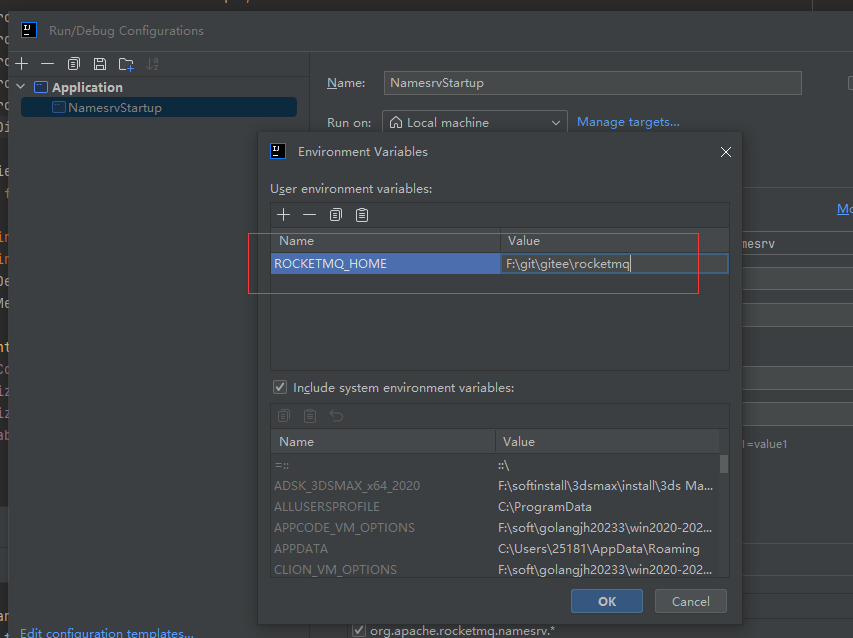
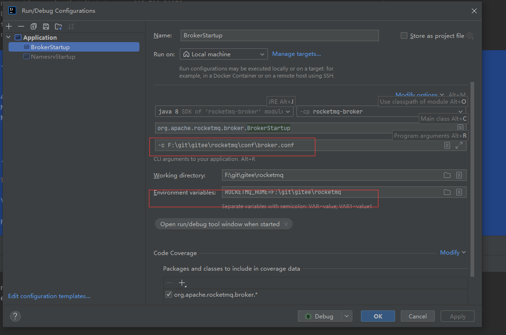
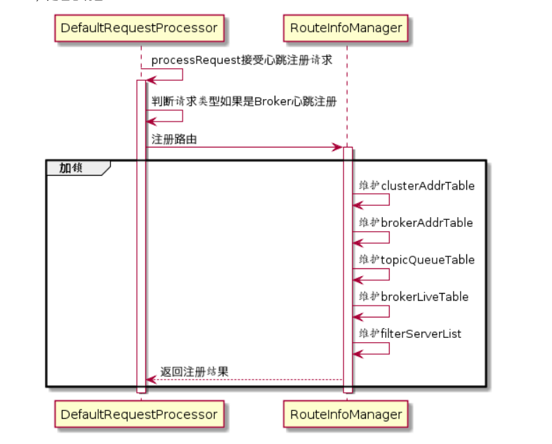
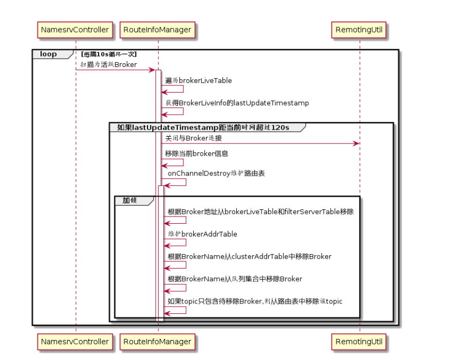
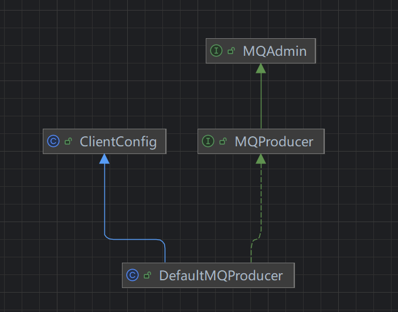

# 源码跟踪

# 源码测试启动

1. 根目录建立conf文件，在distribution下，复制这三个文件到conf下

broker.conf
logback_broker.xml
logback_namesrv.xml

2. 启动nameserver，需配置环境变量



3. 启动brocker
4. 添加配置文件

```yaml
brokerClusterName = DefaultCluster
brokerName = broker-a
brokerId = 0
deleteWhen = 04
fileReservedTime = 48
brokerRole = ASYNC_MASTER
flushDiskType = ASYNC_FLUSH


# namesrvAddr地址
namesrvAddr=127.0.0.1:9876
# 启用自动创建主题
autoCreateTopicEnable=true
# 存储路径
storePathRootDir=F:\\git\\gitee\\rocketmq\\dataDir
# commitLog路径
storePathCommitLog=F:\\git\\gitee\\rocketmq\\dataDir\\commitlog
# 消息队列存储路径
storePathConsumeQueue=F:\\git\\gitee\\rocketmq\\dataDir\\consumequeue
# 消息索引存储路径
storePathIndex=F:\\git\\gitee\\rocketmq\\dataDir\\index
# checkpoint文件路径
storeCheckpoint=F:\\git\\gitee\\rocketmq\\dataDir\\checkpoint
# abort文件存储路径
abortFile=F:\\git\\gitee\\rocketmq\\dataDir\\abort
```

5. 配置启动参数



6. 测试发送消息

进入example模块的 org.apache.rocketmq.example.quickstart，发送消息

# nameserver解读

## 启动流程

1. 启动类：<b id="blue">NamesrvStartup</b>

2. <b id="blue">createNamesrvController</b>：通过netty,创建一个controller

   1. 封装netty相关的参数
   2. 指定端口为9876
   3. 如果有-c则证明有指定配置文件，则读取指定的配置文件，将其封装到NamesrvConfig中
   4. <b id="blue">MixAll.properties2Object</b>：将命令行参数封装到NamesrvConfig中

3. <b id="blue">start</b>：启动

   1. <b id="blue">controller.initialize</b>：初始化controller

   ```java
   //扫描不活跃broker   
   this.scheduledExecutorService.scheduleAtFixedRate(new Runnable() {
          @Override
          public void run() {
              NamesrvController.this.routeInfoManager.scanNotActiveBroker();
          }
      }, 5, 10, TimeUnit.SECONDS);
   ```

   

   

   1. <b id="blue">ShutdownHookThread</b>：添加关闭的钩子函数

### NamesrvConfig

1.  <b id="blue">rocketmqHome</b>:rocketmq主目录

### NettyServerConfig

# 路由管理

## 路由元信息RouteInfoManager

```java
// topic对应的队列集合
private final HashMap<String/* topic */, List<QueueData>> topicQueueTable;
// brocker对应的位置信息
private final HashMap<String/* brokerName */, BrokerData> brokerAddrTable;
//集群对应的brocker
private final HashMap<String/* clusterName */, Set<String/* brokerName */>> clusterAddrTable;
private final HashMap<String/* brokerAddr */, BrokerLiveInfo> brokerLiveTable;
private final HashMap<String/* brokerAddr */, List<String>/* Filter Server */> filterServerTable;
```

## BrokerLiveInfo

> 是 RocketMQ 中用于**描述 Broker 节点实时存活状态**的核心数据结构，主要由 NameServer 维护和管理

```java
public class BrokerLiveInfo {
    // 1. Broker 上次发送心跳的时间戳（毫秒），NameServer 据此判断 Broker 是否存活
    private long lastUpdateTimestamp;
    // 2. Broker 处理客户端请求的核心端口（默认 10911），客户端通过该端口与 Broker 通信
    private int port;
    // 3. Broker 的版本号（用于兼容不同版本的 RocketMQ 协议）
    private int version;
    // 4. Broker 的 HA 服务器地址（主从复制时，从节点连接主节点的地址）
    private String haServerAddr;
    // 5. Broker 的私有扩展字段（可自定义存储额外信息）
    private HashMap<String, String> putProperty;
```

## brocker启动流程

1. 找到org.apache.rocketmq.broker.BrokerStartup#createBrokerController
2. 之所以有server和client，是因为client去连接nameserver,处理心跳注册信息

```java
final NettyServerConfig nettyServerConfig = new NettyServerConfig();
final NettyClientConfig nettyClientConfig = new NettyClientConfig();
```

3. 设置写死的broker监听端口号

```java
nettyServerConfig.setListenPort(10911);
```

4. 检查nameserver的地址配置是否正确

```java
String namesrvAddr = brokerConfig.getNamesrvAddr();
if (null != namesrvAddr) {
    try {
        String[] addrArray = namesrvAddr.split(";");
        for (String addr : addrArray) {
            RemotingUtil.string2SocketAddress(addr);
        }
    } catch (Exception e) {
        System.out.printf(
            "The Name Server Address[%s] illegal, please set it as follows, \"127.0.0.1:9876;192.168.0.1:9876\"%n",
            namesrvAddr);
        System.exit(-3);
    }
}
```

5. 如果broker配置是master,则设置brokerId=0,如果是slave,配置的brockerId<=0,立马退出

```java
switch (messageStoreConfig.getBrokerRole()) {
    case ASYNC_MASTER:
    case SYNC_MASTER:
        brokerConfig.setBrokerId(MixAll.MASTER_ID);
        break;
    case SLAVE:
        if (brokerConfig.getBrokerId() <= 0) {
            System.out.printf("Slave's brokerId must be > 0");
            System.exit(-3);
        }

        break;
    default:
        break;
}
```

6. 10911是与客户端的通信端口，10912是与slave的通信端口

```java
messageStoreConfig.setHaListenPort(nettyServerConfig.getListenPort() + 1);
```

7. start过程
8. 将brocker注册到nameserver

```java
this.registerBrokerAll(true, false, true);
```

9. 通过多线程的方式，使用netty往nameserver注册

## brocker注册过程

1. 在org.apache.rocketmq.broker.out.BrokerOuterAPI#registerBrokerAll方法中，可以看到注册代码

```java
RegisterBrokerResult result = registerBroker(namesrvAddr,oneway, timeoutMills,requestHeader,body);
```

2. 在nameserver中，DefaultRequestProcessor是专门用于服务请求处理的
   1.  registerBrokerWithFilterServer对brocker 信息交给getRouteInfoManager处理

```java
//处理brocker的注册信息 
case RequestCode.REGISTER_BROKER:
                Version brokerVersion = MQVersion.value2Version(request.getVersion());
                if (brokerVersion.ordinal() >= MQVersion.Version.V3_0_11.ordinal()) {
                    return this.registerBrokerWithFilterServer(ctx, request);
                } else {
                    return this.registerBroker(ctx, request);
                }
```

## RouteInfoManager

1.  createAndUpdateQueueData ： 将brocker对应的queue信息存起来/或者更新queue信息

2.  brokerLiveTable ： 存入 或者的broker信息

## 注册处理



## 心跳处理


> 扫描超时120s的不活跃brocker

- RouteInfoManager#scanNotActiveBroker：扫描不活跃的brocker
-  onChannelDestroy: 加锁之后，迭代删除不活跃的brocker



## 路由发现

RocketMQ路由发现是非实时的，当Topic路由出现变化后，NameServer不会主动推送给客户端，而是由客户端定时拉取主题最新的路由。

getRouteInfoByTopic: 通过主题，获取路由信息

 pickupTopicRouteData： 找到主题对应的queue的server的相关的信息

# 客户端源码跟踪

## 消息发送者

核心类：DefaultMQProducer

类图:




## 启动流程

1. 调用DefaultMQProducer#start，进入启动流程
2. checkConfig ： 检查生产者组
3. 设置InstanceName为pid
4. 调用MQClientInstance#start，启动客户端
   1. fetchNameServerAddr：如果获取不到NamesrvAddr，则去一个http地址获取配置

```java
//通过这个地址去获取配置
public static final String DEFAULT_NAMESRV_ADDR_LOOKUP = "jmenv.tbsite.net";
```

## 发送消息

1. 观察DefaultMQProducerImpl#sendDefaultImpl方法

2. 根据主题信息获取topic信息

```JAVA
TopicPublishInfo topicPublishInfo = this.tryToFindTopicPublishInfo(msg.getTopic());
```

```java
private TopicPublishInfo tryToFindTopicPublishInfo(final String topic) {
    //从本地缓存获取
    TopicPublishInfo topicPublishInfo = this.topicPublishInfoTable.get(topic);
    if (null == topicPublishInfo || !topicPublishInfo.ok()) {
        this.topicPublishInfoTable.putIfAbsent(topic, new TopicPublishInfo());
        //从nameserver获取topic信息
        this.mQClientFactory.updateTopicRouteInfoFromNameServer(topic);
        topicPublishInfo = this.topicPublishInfoTable.get(topic);
    }

    if (topicPublishInfo.isHaveTopicRouterInfo() || topicPublishInfo.ok()) {
        return topicPublishInfo;
    } else {
        this.mQClientFactory.updateTopicRouteInfoFromNameServer(topic, true, this.defaultMQProducer);
        topicPublishInfo = this.topicPublishInfoTable.get(topic);
        return topicPublishInfo;
    }
}
```

3. 发送次数定义

```java
//发送次数
//同步发送=1+重试次数
//异步发送/oneway=就发送一次
int timesTotal = communicationMode == CommunicationMode.SYNC ? 1 + this.defaultMQProducer.getRetryTimesWhenSendFailed() : 1;
```

4. 发送queue获取

```java
// 根据topic路由信息，和上一次的brocker，获取发送的queue
String lastBrokerName = null == mq ? null : mq.getBrokerName();
MessageQueue mqSelected = this.selectOneMessageQueue(topicPublishInfo, lastBrokerName);
```

5. 规避故障的brocker

```java
public MessageQueue selectOneMessageQueue(final TopicPublishInfo tpInfo, final String lastBrokerName) {
    //启用延迟发送
    if (this.sendLatencyFaultEnable) {
        try {
            // 获取发送消息的queueId
            int index = tpInfo.getSendWhichQueue().getAndIncrement();
            for (int i = 0; i < tpInfo.getMessageQueueList().size(); i++) {
                //通过取模的方式循环获取
                int pos = Math.abs(index++) % tpInfo.getMessageQueueList().size();
                if (pos < 0)
                    pos = 0;
                MessageQueue mq = tpInfo.getMessageQueueList().get(pos);
                //latencyFaultTolerance: 规避一定时间内的故障brocker
                if (latencyFaultTolerance.isAvailable(mq.getBrokerName())) {
                    if (null == lastBrokerName || mq.getBrokerName().equals(lastBrokerName))
                        return mq;
                }
            }
```

# 消息存储源码

## DefaultMessageStore#putMessages

1. 入口类，做了一系列的判断
2. 调用CommitLog#putMessage进行写入操作

## CommitLog#putMessage

1.  如果mapperfile不存在或者满了，则创建新的mapperfile
2. 调用MappedFile#appendMessage 写入到消息写入到mapperFile
3. 刷盘
4. 同步到HA

## MappedFile#appendMessagesInner

1.  获取文件指针
2.  开始往文件写内容
3. 调用AppendMessageCallback#doAppend

## DefaultAppendMessageCallback#doAppend

1.  文件写入位置
2.  设置消息ID
3.  消息是如果没有足够的存储空间则新创建CommitLog文件